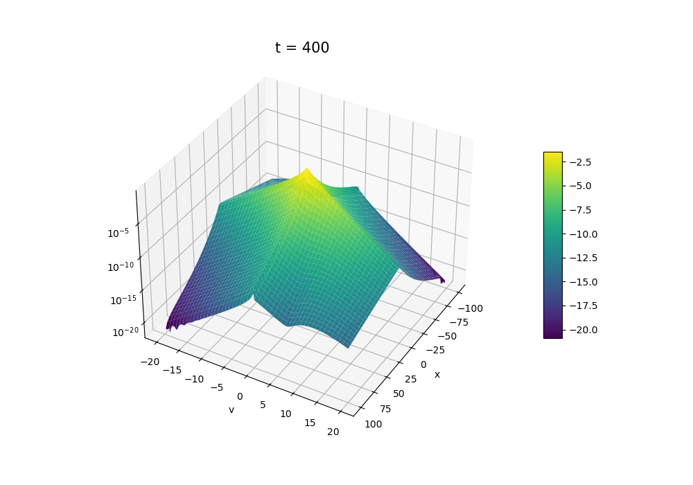

# Run and Tumble Equation Simulation

This repository contains two Python implementations for the **numerical simulation of the Run and Tumble equation**.

$$\partial_tf (t,x,v)+ v\cdot\nabla_x f (t,x,v)= \mathcal{M}(v) \int_{\mathbb{R}^d}\Lambda\left( \frac{x\cdot v'}{\lfloor x \rceil}\right) f(t,x,v')dv '-\Lambda\left(  \frac{x\cdot v}{\lfloor x \rceil}\right)f(t,x,v),$$

For the theoretical background and mathematical framework underpinning this simulation, please refer to the pre-print:
[arXiv:2505.08061](https://arxiv.org/pdf/2505.08061)

The function $f$ represent the density in the phase space of bacteria moving through space and altering their velocity based on environmental gradients of chemotactic substances. The code simulates the evolution of $f$ in time. We suppose that the density of such chemotactic substance is concentrating around the origin and is exponentially decreasing in space. The presence of the substance is 'felt' by the bacteria thanks to the function $\Lambda$, which modules how they decide to reorient. Bacteria are attracted by this substance and they tend to accumulate around the origin as well. The function $\mathcal{M}= \mathcal{M}(v)$ tells us how bacteria choose a new velocity at every turn: it represent the probability distribution of the new velocity. 

The main interest of this project is the shape of the equilibrium state, that is the distribution the bactieria density $f$ reaches for large times $T\to\infty$. 

### Physical Parameters
* $\gamma$: Controls the heavy/light tails of the local velocity equilibrium.  $\mathcal{M}(v) = \exp\big(-\frac{|v|^\gamma}{\gamma}\big)$
* $\chi$: Chemotactic sensitivity parameter $0 < \chi < 1$. $\chi\approx 0$ means that bacteria don't feel the substance, $\chi\approx 1$ means that the bacteria are very sensible to the substance

### Numerical Parameters
* `Tmax`, `Lmax`, `Vmax`: Upper bounds for the temporal, spatial, and velocity domains.
* `dx`, `dv`: Space and velocity grid resolution.

The first numerical method in `General_RunAndTumble.py` is based on a finite difference discretization of the domain and it is suitable for *more general tumbling kernels*. The second method in `Laguerre_RunAndTumble.py` is based on a spectral discretization, it is more efficient and it is an *Asymptotic Preserving scheme*.

## Finite difference scheme
* **Upwind Finite Difference Scheme:** Implements a stable first-order upwind scheme to solve the advection (transport) phase of the kinetic model under standard CFL conditions.
* **Anisotropic Tumbling Kernel:** Models velocity updates via a scattering/collision operator parameterized by a smooth sign function $\psi$ and spatial gradients.
* **Convergence & Diagnostics:** Tracks the $L^2$ relative distance/decay of the distribution function $F(x,v,t)$ toward its computed steady state over time, and extracts macroscopic quantities like macroscopic density ($\rho$) and the second velocity moment.
* **Data Serialization:** Automatically saves grid coordinates, final distributions, and decay metrics into a `.pkl` file via `pickle` for easy post-processing.

## Asymptotic Preserving scheme
* **Spectral decomposition in velocity:** Express the solution in the base of Laguerre's orthogonal polynomials and obtain a scheme on the coefficients.
* **Finite difference in space:** Discretise each Laguerre coefficient in space
* **Unconditional stability:** By implementing an implici Euler scheme in time, the algorithm is stable for any size time step.
* **Diagnostic:** At a specified interval in time, the current state of the solution is saved into a `.pkl` file via `pickle` for easy post-processing.

## Steady state
An interesting result is the shape of the stationary solution: when $x$ and $v$ have the same sign, the stationary solution looks like it is piece-wise defined.

  
   
  <em>Plot of steady state in log scale. $\chi=0.8$ and $\gamma=1$.</em>

